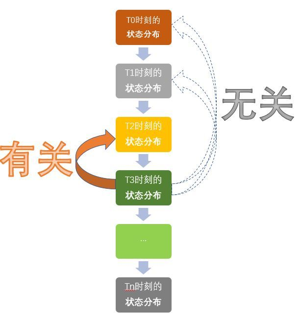
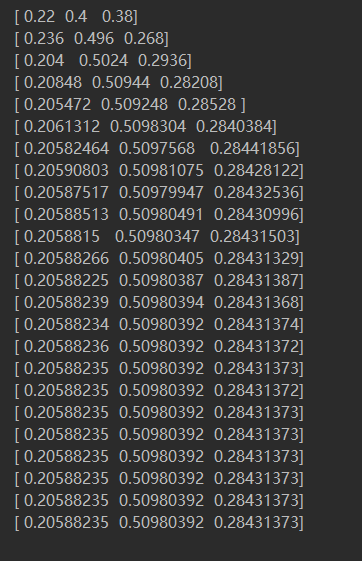
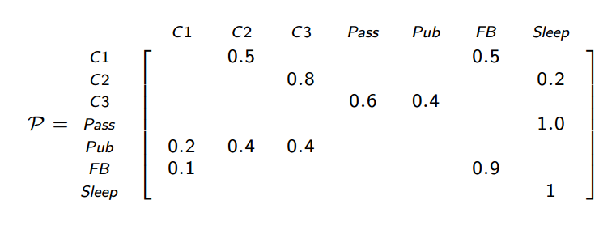
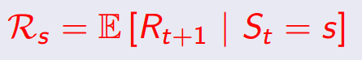
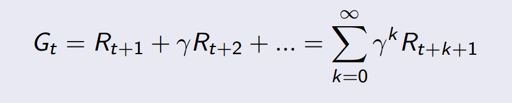

# 马尔科夫链

## 一、概念

马尔可夫链（英语：Markov chain），又称离散时间马尔可夫链，因俄国数学家安德烈·马尔可夫得名，为状态空间中经过从一个状态到另一个状态的转换的随机过程。该过程要求具备“无记忆”的性质：下一状态的概率分布只能由当前状态决定，在时间序列中它前面的事件均与之无关。这种特定类型的“无记忆性”称作马尔可夫性质。马尔科夫链作为实际过程的统计模型具有许多应用。

在马尔可夫链的每一步，系统根据概率分布，可以从一个状态变到另一个状态，也可以保持当前状态。状态的改变叫做转移，与不同的状态改变相关的概率叫做转移概率。随机漫步就是马尔可夫链的例子。随机漫步中每一步的状态是在图形中的点，每一步可以移动到任何一个相邻的点，在这里移动到每一个点的概率都是相同的（无论之前漫步路径是如何的）。

> ``markov chain`` 模型成立的条件是：只与上一个状态有关。是不是有点像链表的意思呢

说到这里，估计大家已经跃跃欲试，那我就先举个栗子，让大家有个直观的了解，然后再深入其原理。

> 以下参考某工科可爱女程序媛的栗子


## 二、可爱而又严谨的栗子

我们村智商为0的王二狗，人傻不拉几的，见人就傻笑，每天中午12点的标配，仨状态：吃，玩，睡。这就是传说中的状态分布。


你想知道他n天后中午12点的状态么？是在吃，还是在玩，还是在睡？这些状态发生的概率分别都是多少？
（知道你不想，就假装想知道吧~~学习真的好累~~）

先看个假设，他每个状态的转移都是有概率的，比如今天玩，明天睡的概率是几，今天玩，明天也玩的概率是几几，看图更清楚一点。


这个矩阵就是转移概率矩阵P，并且它是保持不变的，就是说第一天到第二天的转移概率矩阵跟第二天到第三天的转移概率矩阵是一样的。（这个叫时齐，不细说了，有兴趣的同学自行百度）。   

有了这个矩阵，再加上已知的第一天的状态分布，就可以计算出第N天的状态分布了。


S1 是4月1号中午12点的的状态分布矩阵 [0.6, 0.2, 0.2]，里面的数字分别代表吃的概率，玩的概率，睡的概率。

那么，

4月2号的状态分布矩阵 S2 = S1 * P (俩矩阵相乘)。

4月3号的状态分布矩阵 S3 = S2 * P (看见没，跟S1无关，只跟S2有关)。

4月4号的状态分布矩阵 S4 = S3 * P (看见没，跟S1，S2无关，只跟S3有关)。

......

4月n号的状态分布矩阵 Sn = Sn-1 * P (看见没，只跟它前面一个状态Sn-1有关)。

**马尔可夫链就是这样一个任性的过程，它将来的状态分布只取决于现在，跟过去无关！**

**就把下面这幅图想象成是一个马尔可夫链吧。实际上就是一个随机变量随时间按照Markov性进行变化的过程**




## 三、Coding

本人在看到以上讲解时，就很想知道到底第4月n号的各概率是多少，所以就写了以下``code``，仅供吐槽，有什么需要优化的地方，请各位大佬尽情指出：

```python

def markov():
    # 此处为了保持和原博文中参数形式一致
    status_changer = np.array([[0.2, 0.3, 0.5], [0.1, 0.6, 0.3], [0.4, 0.5, 0.1]])
    status_changer = status_changer.T
    status = np.array([0.6, 0.2, 0.2])
    for day in range(1, 25):
        status = np.dot(status_changer, status.T)
        print(status)


markov()

```

最终的计算结果如下所示：




根据上图可以看出，``markov``链执行18次以后，其节点参数保持一致，保持稳定。


到此，基本上掌握了markov的基本表象，接下来就看看我一本正经的解释吧~_~~..


## 四、介绍

4.1 特点

- 环境是可观察的，如：AlphaGo下围棋可以模拟出来的
- 所有增强学习过程都可以被MDP模型描述出来
    - 最优控制能够解决连续性问题
    - 即使是部分可观察性问题，也可以用MDP来描述

- **The future is independent of the past given the present**

    马尔科夫成立的条件：当且仅当以下条件成立

    

4.2 重要特性

- 马尔科夫过程或者换马尔科夫链包含两个重要参数：<S,P>

    - S：节点状态的结合

    - P：状态转换概率矩阵

    关系如下：

    

- 马尔科夫链的栗子

    

    其中训练之后的概率结果为：

    

    空白数据中概率默认为0

4.3 马尔科夫奖励过程

奖励过程就是获得带值的马尔科夫链过程。

马尔科夫奖励过程包含四个参数：<S,P,R,q>

- S：有限节点状态的集合

- P：节点状态转换矩阵

- R：奖励函数

    

- q：为权衡参数


原始描述如下：


训练之后的马尔科夫过程为如下图：


4.4 结果

马尔科夫奖励过程返回的结果为：




*** 
参考链接：

- [马尔科夫链](https://zh.wikipedia.org/wiki/%E9%A9%AC%E5%B0%94%E5%8F%AF%E5%A4%AB%E9%93%BE)
- [马尔可夫链 （Markov Chain）是什么鬼](https://zhuanlan.zhihu.com/p/26453269)
- 