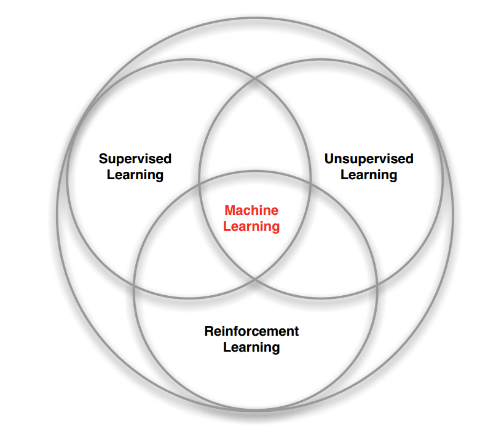
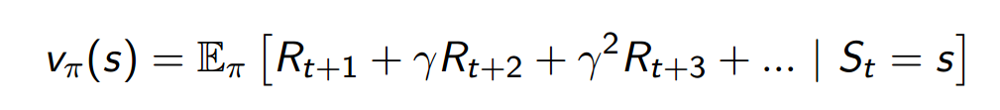

# 强化学习

## 一、概念
强化学习是机器学习中的一个领域，强调如何基于环境而行动，以取得最大化的预期利益。

其灵感来源于心理学中的行为主义理论，即有机体如何在环境给予的奖励或惩罚的刺激下，逐步形成对刺激的预期，产生能获得最大利益的习惯性行为。

在机器学习问题中，环境通常被规范为马可夫决策过程（MDP），所以许多强化学习算法在这种情况下使用动态规划技巧。传统的技术和强化学习算法的主要区别是，后者不需要关于MDP的知识，而且针对无法找到确切方法的大规模MDP。

强化学习和标准的监督式学习之间的区别在于，它并不需要出现正确的输入/输出对，也不需要精确校正次优化的行为。强化学习更加专注于在线规划，需要在探索（在未知的领域）和遵从（现有知识）之间找到平衡

- 基本的强化学习模型包括：
    - 环境状态集合S
    - 动作的集合A
    - 在状态之间转换的规则
    - 规定转换之后的 “即时奖励”规则
    - 描述主体能够观察到什么的规则

规则通常是随机的。主题通常可以观察即时奖励和最后一次转换，

## 二、介绍

- 增强学习与监督学习和非监督学习的区别：
    - 很明显，此处没有监督者(label)，只有奖励信号
    - 反馈是延迟的
    - 时间因素非常重要（需要顺序、非独立分布的数据）
    - 上一步的操作，将会影响下一步的状态

- 奖励

    - 每个节点Rewar Rt是一个弹性的反馈奖励
    - 

> 增强学习是建立在奖励假说上

> 所有的目标都可以用期望最大化累计奖励来描述

- 顺序决策的指定
    - 目标：选择最大化的目标奖励路线
    - 选择的路线可能会比较长
    - 反馈将会被延迟
    - 我们更应该考虑长期奖励效益，而不是短期奖励效益

我们来看看，人类大脑是怎么学习的：

- 对于大脑
    - 执行动作At
    - 接受(观察)环境变化Qt
    - 接受(获得)奖励Rt

- 对于环境
    - 接受动作At
    - 发出观察现象Qt
    - 发出弹性奖励信号Rt

- 反复执行以上动作，t只是时间序列中的一小步

## 三、历史信息和状态的关系

- 历史信息只是一系列顺序的观察、执行动作、奖励数据

    Ht = O1; R1; A1; :::; At−1; Ot; Rt

- 每个节点接下来将会执行什么动作，将取决于：
    - 该节点选择了什么动作
    - 环境发出了什么观察现象和奖励

- 状态决定下一步的变化情况

- 每一个节点应该包含以下信息
    - Policy：节点动作选择函数

        - 策略代表着节点的动作

        - 是当前节点到下一个节点的映射关系

    - Value Function

        - 是未来奖励的预测函数

        - 用来判断状态的好坏

        - 选择接下来的动作

            

    - 用来描述节点环境因素的模型数据

## 四、实际应用

4.1 迷宫

- 规则

    

    - 每前进一步奖励就 -1
    - 每一步的执行动作有：上下左右
    - 状态：在迷宫中的坐标位置

- 训练之后的效果图：

    

4.2 游戏

- 介绍

    

    - 规则甚至是不知道的

    - 直接从打游戏的实战中学习到相关参数

    - 通过游戏中的图像、遥控杆、最终分数来进行学习，实现最终通过图像来操作遥控杆来获得尽量高的分数

## 五、总结

- 增强学习是在训练和错误中学习

- 算法会发觉一个好的策略

- 根据累计环境因素来学习

- 根据环境能勘探(Exploration)出更多信息

- 根据奖励能挖掘(Exploitation)出最优信息

- 前期的勘探信息和后期的挖掘信息都是非常重要

这里举一个栗子：

***
- [文档学习资料](http://www0.cs.ucl.ac.uk/staff/D.Silver/web/Teaching.html)

- [视频学习资料](https://www.bilibili.com/video/av9833386?from=search&seid=13106737826455663623)
