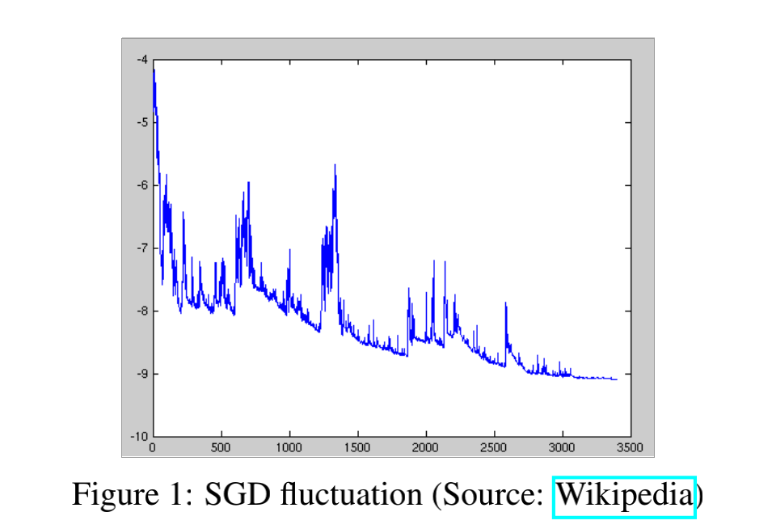
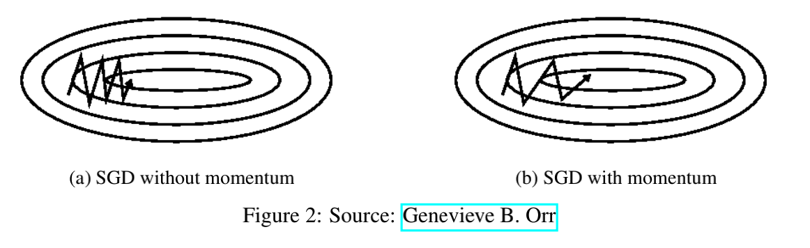
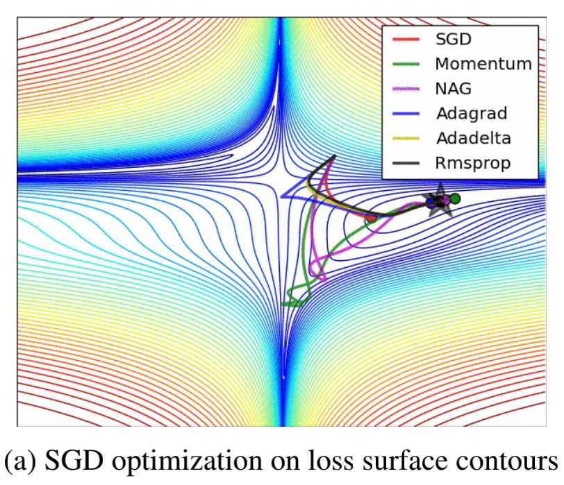

# 深度学习中的优化算法

## 一、概览

优化算法的基础在于梯度下降，故需要深入理解其原理过程，才能够掌握优化的目标和过程。

李宏毅老师和吴恩达老师深入浅出的介绍了梯度下降的不同层面的信息，他们的教学视频是最好的学习资料，在此我给出了B站上面搬运的视频地址：

- [吴恩达](https://www.bilibili.com/video/BV164411b7dx?p=9)
- [李宏毅](https://www.bilibili.com/video/BV13x411v7US?p=6)

## 二、Batch Gradient Descent

在一组数据集上只需要更新一次梯度，而非是每个数据计算损失后都要计算一次梯度。

- 公式
  $$
  \theta_{i+1}=\theta_{t}-\eta g_{t}
  $$

- 优点

  - 减少个别数据对整体梯度上的影响。

- 缺点

  - 由于是在所有数据集上计算出总体损失后再来更新梯度，故总体计算速度非常慢。特别是当数据集变得非常大的时候，此时更新速度让人抓狂。
  - 无法做到online更新

- 伪代码

```python
for i in range ( nb_epochs ):
    params_grad = evaluate_gradient ( loss_function , data , params )
    params = params - learning_rate * params_grad
```

上述代码中，`nb_epochs`为预设置的训练轮次，一般为手动设置，也可根据损失函数的稳定性来动态决定；`loss_function`就是系统配置的损失函数，如果是回归任务，那可为均方误差损失函数，如果是分类任务，则可为基于交叉熵的损失函数；`params_grad`就是每个需要训练参数上的各个参数集合；`learning_rate`就是学习率，一般为手动设置，也可根据梯度的状态来进行动态更新，具体规则如下会一一介绍；

经过多轮次的计算，`params`即可得到更新，并最终趋于稳定状态。

其实介绍到这里，各位看官估计也已经想到了里面的一些问题。对于复杂的梯度更新情况下，会存在一个很大的问题：只能够达到局部最优，无法达到全局最优。

举一个栗子，一个人在只有一米视野的范围下在山谷上四处游走，那么当他走到了一个小坑之中的时候，他很有可能觉得这是他见过的最低位置，此时就是局部最优。此时由于视野的盲区，且为一个人在走，故无法在达到全局最优，所以解决办法就是：找很多人，随机散落在山谷中的不同地方，让后让他们自己在四处走，每个人都要找到自己的局部最优，最后根据所有人的局部最优就能够近似的推导出全局最优。这就是我接下来要介绍的SGD。

> 或许有人会说：这到底是不是真理上的全局最优。可马克思告诉我们：真理具有相对性。


在这里插播一个知识点：`online learning`和`batch_learning`，两者都是一种训练方法。`batch learning`在训练的过程中，先对所有样本数据计算损失，累计之后再来更新梯度。`online learning`则每计算一组数据集就来更新梯度。


## 二、SGD

全称 **Stochastic gradient descent**，随机梯度下降。与**Batch gradient descent**相反，每个训练样本计算损失之后都会更新一下梯度，这会让梯度的更新速度变得非常快。

### 2.1 公式

$$
\theta=\theta-\eta \cdot \nabla_{\theta} J\left(\theta ; x^{(i)} ; y^{(i)}\right)
$$

### 2.2 优点

- 步骤是最简单的
- 计算效率高，收敛速度快

### 2.3 缺点

- 不同数据下的分布不一致，会导致数据更新方差较大，最终呈现出来的就是不稳定的现象。



伪代码如下所示：

```python
for i in range ( nb_epochs ):
  np . random . shuffle ( data )
  for example in data :
    params_grad = evaluate_gradient ( loss_function , example , params )
    params = params - learning_rate * params_grad
```

大家看上图便知，SGD实际上是很不稳定的，而这个不稳定性问题还是因为数据量太小，每个训练都能够对梯度的更新产生影响，这样一些边界或异常样本点就会扰乱梯度的更新。于是为了解决这个问题，`Mini-batch gradient descent`就产生了。

实验证明，如果当减小学习率的话，SGD的收敛效果与Batch Gradient Descent一致。

## 三、Mini-Batch Gradient Descent

结合了`Batch Gradient Descent`和`SGD`两者的优点，不再是针对对每个样本都要进行梯度更新，而是根据一小组样本点再更新一次梯度。

### 3.1 公式

$$
\theta=\theta-\eta \cdot \nabla_{\theta} J\left(\theta ; x^{(i: i+n)} ; y^{(i: i+n)}\right)
$$

### 3.2 伪代码

```python
for i in range ( nb_epochs ):
  np . random . shuffle ( data )
    for batch in get_batches ( data , batch_size =50):
    params_grad = evaluate_gradient ( loss_function , batch , params )
    params = params - learning_rate * params_grad
```

这种模式既能够兼顾**Batch Gradient Descent**的训练效果，也可以借鉴**SGD**的高效训练速度和全局最优，特别是在多GPU上训练尤为重要。因为一个**batch_data**的数据可在不同GPU上训练，实现并行计算。

### 3.3 问题与挑战

虽然这种效果理论上非常好，可实际训练过程中梯度计算往往非常复杂，这种模式无法每次都能够有效收敛，故为了解决在现实梯度计算的过程中面临的种种困难，优化算法面临着一些挑战：

- 很难选择一个合适的学习率

  如果学习率太小，将很难收敛。如果学习率太大，将很难获得最优解，甚至一直在最优解周围震荡。

- 在训练的过程中动态的调整学习率

  这个最经典的算法就是**模拟退火算法**，另外还有在训练的过程中可将学习率逐步减小到一个预设值，也可针对训练过程中梯度的变化率来动态改变学习率。

- 学习率是可适用到所有参数的更新规律上

  可我们根据直觉来讲，参数的更新变化规律不一定是一致的，应该根据不同参数的重要程度来调整不同参数的学习率。一个学习率的规律应用到所有参数上的变化，将会导致部分参数无法学习到其客观上的最佳值。特别是对于一些数据不平衡状态下的数据训练，应根据数据频率的不同，适当的更新不同区域内的参数。

- 如果解决鞍点

  在学习的过程中，鞍点往往意味着两个局部最优，可如果进入一个局部最优之后，往往是无法逃脱以便进入另外一个局部最优，故这也是目前所需要研究的重点。

为了解决以上挑战，有很多方法依次被提出，下面我将会一一介绍。

## 四、梯度下降优化算法

### 4.1 动量

很容易与物理中的冲量联系到一起，不过还真是有异曲同工之处。打个最形象的比方，当我们从山顶往下推一个球下去，当下降的时候，球的速度会越来越小，当球上升的时候，球的速度会越来越小。即使是遇到了谷底，基于冲量还会进行梯度更新。

在更新梯度的时候，下一时刻的更新变化大小是与上一时刻有关，故可以解决SGD在峡谷和阻尼震荡方面的影响。效果图如下所示：



**公式如下：**
$$
\begin{aligned}
v_{t} &=\gamma v_{t-1}+\eta \nabla_{\theta} J(\theta) \\
\theta &=\theta-v_{t}
\end{aligned}
$$

上述公式中的 $\gamma$ 就是动量参数，通常设置成0.9或者更小。

实验证明，基于动量方法，能够有效的加快收敛速度，减小震荡的情况。

可从另一个角度来看，如果速度实在太快，有可能会在两个峡谷之间不停的**震荡**，这也是一个问题，于是提出了**NAG**算法来对动量公式稍作调整，以此缓解这个问题。

### 4.2 Nesterov accelerated gradient

当一个球从山上往下滚的时候，NAG能够让小球知道它什么时候该加速，什么时候该减速，都能够预先知道。

**公式：**
$$
\begin{aligned}
v_{t} &=\gamma v_{t-1}+\eta \nabla_{\theta} J\left(\theta-\gamma v_{t-1}\right) \\
\theta &=\theta-v_{t}
\end{aligned}
$$
与动量相比，公式主要在与计算梯度的时候产生了一定的变化。$\gamma v_{t-1}$代表着基本动量变化规律，$\theta-\gamma v_{t-1}$近似代表着下一个参数点，由此就能够提前预知下一个点的梯度和当前动量联合调整参数梯度。

至此，我们已经能够很好的缓解无法跳出局部最优，梯度震荡等问题，同时加速SGD的训练速度。可仍然还遗留一个问题就是：无法根据不同参数的重要程度来动态的进行参数更新。可Adagrad能够做到这一点。

### 4.3 Adagrad

原理：对一些不经常更新的参数就使用大的学习率，对经常更新的参数就使用较小的学习率。

也正是因为这个特征，Adagrad能够很好的应用在稀疏数据上，实验证明，Adagrad的鲁棒性比SGD要高很多，且能够应用在海量数据集上，Golve预训练词向量就是使用的这个优化方法。

在之前所介绍的方法中，所有参数都拥有统一的学习率，可此时每个参数$\theta_i$都有自己的学习率 $\eta$，且每个学习都是随着训练的步数的变化而变化。
$$
g_{t, i}=\nabla_{\theta_{t}} J\left(\theta_{t, i}\right)
$$
$g_{t,i}$为参数$\theta_i$的$t$步数下的梯度函数。根据SGD的更新策略，参数更新的公式如下所示：
$$
\theta_{t+1, i}=\theta_{t, i}-\eta \cdot g_{t, i}
$$
基于这个策略，Adagrad对每个参数的不同时间步数下的更新策略做了一定的调整，公式如下：
$$
\theta_{t+1, i}=\theta_{t, i}-\frac{\eta}{\sqrt{G_{t, i i}+\epsilon}} \cdot g_{t, i}
$$
上述公式中，$G_{t} \in \mathbb{R}^{d \times d}$是一个对角矩阵，而对角上的参数为每次时间步数上梯度的累积，可以表示成：

$$
G_{t,ii} = \sum_{i=0}^{t-1} g_{t,i}^2
$$

上述公式中的$\epsilon$为平滑参数，为了防止分母为0，通常设置为$1e-8$。

> 这个算法中有一个很奇怪的地方就是：如果不对$G_{t,ii} + \epsilon$作开方，性能将会非常差。

将上述公式整合成一个矩阵表达式为：
$$
\theta_{t+1}=\theta_{t}-\frac{\eta}{\sqrt{G_{t}+\epsilon}} \odot g_{t}
$$
Adagrad一个很大的优点在于，消除了手动设置并调整参数的需要。

可你认为Adagrad就是完美的吗？No，还是有缺点的。比如在分母中积累了所有参数的平方运算，所有的值都是正树，故$G_t$会越来越大，对应的将会使学习速度变得越来越小，且随着训练的步数增加，这种变化就越明显，最终会有一种无法更新的问题。

Adadelta算法能够解决这个问题。

### 4.4 Adadelta

**Adadelta**是Adagrad算法的一个扩展，同时为了解决其学习率单调递减的问题。

原理：$G_t$并不是之前所有步数上梯度的累积，而是通过存储该时间步数上前$w$个梯度值，然后算均方以此来调整学习率。公式如下：
$$
E\left[g^{2}\right]_{t}=\gamma E\left[g^{2}\right]_{t-1}+(1-\gamma) g_{t}^{2}
$$
$g_t^2$为步数$t$下的梯度平方。$E[g^2]_{t-1}$为步数$t-1$下的梯度均方，$\gamma$为之前所介绍的动量概念。

于是，再根据SGD来设置更新策略：
$$
\theta_{t+1}=\theta_{t}+\Delta \theta_{t} \\
\Delta \theta_{t}=-\frac{\eta}{\sqrt{E\left[g^{2}\right]_{t}+\epsilon}} g_{t}\\
$$
由于分母是平方的开放，故可用简化为：
$$
\Delta \theta_{t}=-\frac{\eta}{R M S[g]_{t}} g_{t}
$$
可作者在实际训练的过程中发现，梯度的更新规律与参数变化规律并没有对应上，什么意思呢？就是参数的变化规律实际上和梯度的变化规律是不一样的，就像速度和加速度。那此时我们在计算下一个时刻的速度时，衰减策略完全是根据梯度的变化，故并未能够真正匹配上变化规律，故作者将衰减策略稍作更改：
$$
R M S[\Delta \theta]_{t}=\sqrt{E\left[\Delta \theta^{2}\right]_{t}+\epsilon} \\

\begin{aligned}
\Delta \theta_{t} &=-\frac{R M S[\Delta \theta]_{t-1}}{R M S[g]_{t}} g_{t} \\
\theta_{t+1} &=\theta_{t}+\Delta \theta_{t}
\end{aligned}
$$
最终实验效果非常好。

Adadelta 无需手动设置学习率，因为它会根据训练的过程梯度的变化而自动调整。

### 4.5 RMSprop

Geoff Hinton 教授在授课的过程中讲述了另外一种算法：RMSprop。这是未经发表，可经实验证明非常有效的自适应优化算法。

RMSprop和Adadelta都是为了解决Adagrad快速消失的学习率问题，而RMSprop实际上是我们在Adadelta推理过程中已经介绍过的一个公式：
$$
\begin{aligned}
E\left[g^{2}\right]_{t} &=0.9 E\left[g^{2}\right]_{t-1}+0.1 g_{t}^{2} \\
\theta_{t+1} &=\theta_{t}-\frac{\eta}{\sqrt{E\left[g^{2}\right]_{t}+\epsilon}} g_{t}
\end{aligned}
$$
Hinton教授推荐$\gamma$设置成0.9，而一个好的默认$\eta$是0.001。

### 4.6 Adam

全称为Adaptive Moment Estimation，也是一个可为每个参数自适应调整学习率的优化算法。

与Adadelta和RMSprop类似，存储着每个参数一定窗口大小的梯度累积平方和$v_t$，**此外**还存储着每个参数的累积衰减数据$m_t$，同样类似于动量概念，对这两个参数进行动态调整，参数如下：
$$
\begin{aligned}
m_{t} &=\beta_{1} m_{t-1}+\left(1-\beta_{1}\right) g_{t} \\
v_{t} &=\beta_{2} v_{t-1}+\left(1-\beta_{2}\right) g_{t}^{2}
\end{aligned}
$$

$$
\begin{aligned}
\hat{m}_{t} &=\frac{m_{t}}{1-\beta_{1}^{t}} \\
\hat{v}_{t} &=\frac{v_{t}}{1-\beta_{2}^{t}}
\end{aligned}
$$

$$
\theta_{t+1}=\theta_{t}-\frac{\eta}{\sqrt{\hat{v}_{t}}+\epsilon} \hat{m}_{t}
$$

作者推荐$\beta_1$默认值为0.9，$\beta_2$为0.999，$\epsilon$为$10^{-8}$。实验证明Adam相对比其他自适应的优化算法而言，计算效率效果都非常好。

### 

## 五、算法可视化

为了更加形象的理解每种算法，下面我将以图的形式介绍他们之间的区别：



> 这个与地理中的等高线概念一致，等到线越密集的地方，说明梯度很大，越是稀疏的地方说明梯度越是平坦。

每种算法都都能够给到达终点，只是路径有所不同。从绘制的线条来看，Adadelta和RMSprop收敛效果是最好的。

## 六、优化算法中的其他策略

在实际的训练过程中，梯度的更新只是一方面，为了让学习快速收敛，获得更好的效果也还有一些其他策略，如下我将一一介绍：

### 6.1 stuffling

在训练的过程中，如果数据很整齐，那每次学习到的特征都是与某一个特征相关，会让学习效果有所偏差。所以一般在训练的过程中，推荐要将数据打乱，这样才能够更好的实现泛化能力，而且这也是目前主流的方式。

不过，在Curriculum Learning中，将数据根据特征进行排序，能够获得非常好的效果。

### 6.2 batch normalization

如果神经网络中的参数分布非常稀疏，方差较大，将会降低训练效果，且随着神经网络层数的增加，很可能会导致梯度爆炸问题。如果能将所有参数都给归一化到正态分布下，实验证明能够有效加速收敛速度。

如果我们将batch normalization 作为神经网络中的一部分，那就可以使用较大的学习率。同时也发挥着正则化和dropout的作用。

### 6.3 early stopping

 Geoff Hinton 教授也说过，“Early stopping (is) beautiful free lunch”。如果在验证集上损失一直比训练集上差，实际上就没有必要再继续训练下去了。

### 6.4 gradient noise

在梯度更新时，对梯度添加上高斯噪音$N\left(0, \sigma_{t}^{2}\right)$，能够有效提升泛化能力。
$$
g_{t, i}=g_{t, i}+N\left(0, \sigma_{t}^{2}\right)
$$
而方差的生成策略如下：
$$
\sigma_{t}^{2}=\frac{\eta}{(1+t)^{\gamma}}
$$
实验证明加上这个高斯噪音，能够提升网络中的鲁棒性，也能够允许网络更深更复杂。所以作者猜测，添加上这些噪声之后能够使梯度在计算时，寻找到新的全局最优（比之前的全局最优还要好）。

这个方法常用在深层次的神经网络中。

## 七、结论

在这篇文章中，主要介绍了三种梯度下降方法：

- Batch Gradient Descent
- Stochastic gradient descent
- Mini-batch gradient descent

其中mini-batch gradient descent是最流行的，也是目前学术界和工业界使用最广泛的。另外也提出了对于SGD算法优化算法：Momentum, Nesterov accelerated gradient, Adagrad, Adadelta, RMSprop, Adam。最后还介绍了优化SGD算法中的其他优化策略： shufflfling and curriculum learning，batch normalization, and early stopping。


参考论文：

- [An overview of gradient descent optimization algorithms](http://arxiv.org/abs/1609.04747)
- [Gradient Descent based Optimization Algorithms for Deep Learning Models Training](http://arxiv.org/abs/1903.03614)
- [Stanford - cs231n - optimization](https://cs231n.github.io/optimization-1/)
- [Stanford - cs231n - neural-network](https://cs231n.github.io/neural-networks-3/)
