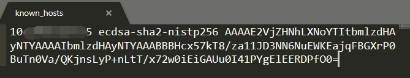

# ssh

## 概述

`Secure SHell` 简称安全壳协议，即SSH，是一种加密的网络传输协议。**可在不安全的网络环境中，提供安全可靠的网络传输**：建立安全的**隧道**来实现SSH客户端和服务端的安全连接。SSH的网络传输服务种类很多，不过最常见的还是远程安全登陆，人们通过ssh来传输命令行界面和执行命令。
虽然ssh是加密的网络传输技术，可是那些高端黑客也是可以将ssh传输的内容给解密出来。

SSH 以非对称加密方式实现身份验证，而非对称加密方法有很多，其中一种就是使用自动生成的公钥和秘钥进行双端加密传输，随后就输入密码进行登录认证。另外一种就是手动生成一对公钥和密码进行加密，这样在身份验证的时候就不需要输入密码了。此时，公钥是存放在待访问的服务端电脑上，私钥需要用户自行保管在自己电脑上。整个认证过程是基于私钥，而传输的过程中私钥是不会进行网络传输的。

`ssh-keygen`工具就是秘钥生成的工具之一。

## 过程

SSH是基于CS模型，服务器需要开启SSH守护进程以接受客户端的连接请求，标准端口中，`22`端口分配给ssh服务使用的。

大多数操作（包括macOS、大部分Linux、OpenBSD、FreeBSD、Solaris等）都自带SSH服务，但windows就是不用，不过我们可以安装ssh客户端来使用ssh服务。比如MobaXterm，或者git bash都是包含ssh服务的。SSH隧道在互联网，虚拟机和防火墙之间提供了一个可靠安全的连接通道。

就ssh的安全验证方式有以下两种：

- 基于密码的安全验证
  知道账户名和密码，就可以远程连接到主机。不过可能会被**中间人攻击**
- 基于秘钥的安全验证
  你必须要自己创建一对公钥和秘钥，然后把公钥放在需要访问的服务器上。当客户端向服务端发送请求后，会将你的传输的公钥和该用户目录下的公钥进行对比，如果一致则使用公钥对数据进行加密，然后发送给客户端。这样即使**中间人**拿到了数据，没有秘钥也不能够将数据解密出来。

当然基于秘钥的过程，秘钥也是可以放在服务器端：用户直接使用公钥对数据进行加密，服务器端接受到数据之后，先对公钥一致性进行验证，然后使用秘钥进行解密，从而保证数据的安全性。
当然也是有一个认证中心进行身份验证，访问者需要携带公钥到认证中心进行核对，验证通过后才可以访问目标主机。

## ssh command

除了ssh命令之外，还有一切周边的有用的命令行工具

- [ssh-keygen](https://www.ssh.com/ssh/keygen/)

  创建一对用于身份验证的公钥和秘钥工具

- [ssh-copy-id](https://www.ssh.com/ssh/copy-id)

  在服务器端为不同用户配置公钥的工具

- [ssh-agent](https://www.ssh.com/ssh/agent)

  使用公钥登录验证的单点登录工具

- [ssh-add](https://www.ssh.com/ssh/add)
  
  给agent添加秘钥的工具

- [scp](https://www.ssh.com/ssh/scp/)

  使用rcp协议传输文件的命令行接口

- [sftp](https://www.ssh.com/ssh/sftp/)

  使用ftp协议传输文件的命令行接口

- [sshd](https://www.ssh.com/ssh/sshd/)

  OpenSSH 服务器

**Linux 客户端**

```shell
ssh sample.host.com
```

如果是第一次会展示出如下信息:

```shell
The authenticity of host 'sample.ssh.com' cannot be established.
DSA key fingerprint is 04:48:30:31:b0:f3:5a:9b:01:9d:b3:a7:38:e2:b1:0c.
Are you sure you want to continue connecting (yes/no)?
```

当输入`yes`之后，ssh服务会将主机对应的**指纹**添加到配置文件中：`~/.ssh/known_hosts`

就拿我本地的`known_hosts`文件为例：



共分为三部分：

- ip/域名地址
- 加密协议
- 指纹

这样服务器端给客户端配置了指纹之后，之后的请求将会把此指纹数据携带过去，服务器端指纹验证通过后即可安全传输数据，也不用输入密码了。以后你就可以畅快的使用shell远程连接服务器端了。

**不同用户登录**

有两种不同的登录命令方式：

```shell
ssh alternative-username@sample.ssh.com

ssh -l alternative-username sample.ssh.com
```

**在服务器上执行命令**

假如要在服务器上执行`ls /tmp/doc`命令：

```shell
ssh sample.ssh.com  ls /tmp/doc
```

只不过，此时也是需要再次输入密码的，因为此时是使用的**指纹**，而不是**秘钥**。

**配置公钥来进行身份验证**

如果想要配置不需要密码的ssh连接，需要进行一些配置：

- [公钥验证](https://www.ssh.com/ssh/public-key-authentication)

- [创建秘钥文件](https://www.ssh.com/ssh/authorized_keys/) 
  - 此时你需要：[ssh-keygen](https://www.ssh.com/ssh/keygen/) 和 [ssh-copy-id](https://www.ssh.com/ssh/copy-id)


## ssh-keygen

这是一个为ssh连接创建公钥秘钥对文件的工具，这些文件可用于自动化登录，单点登录以及域安全认证。
ssh公钥文件就类似于每个用户的身份配置文件，需要分类管理。

**最简单的配置**

```shell
ssh-keygen
```

通过上述命令，文件会默认安装在`~/.ssh文件夹下`。一般会让我们输入文件地址，因为不同大型企业的配置文件地址可能不一样。另外还需要输入`passphrase`，这个是用来对公钥和秘钥文件进行加密的，即使黑客获取了秘钥文件，也无法对数据进行解密。当然，如果公钥，秘钥和`passphrase`都获取了，那只能向神求助了。

**执行协议类型**

```shell
ssh-keygen -t rsa -b 4096
ssh-keygen -t dsa
ssh-keygen -t ecdsa -b 521
ssh-keygen -t ed25519
```
- b 是用来指定key的长度
- t 是用来指定协议的类型

**指定文件名称**

```shell
ssh-keygen -f ~/my-key-filename-ecdsa -t ecdsa -b 521
```

**将公钥文件放到服务器上**

```shell
ssh-copy-id -i ~/my-key-filename user@host
```

这样，下次登录的时候就可以不用输入登录密码了。

## ssh-copy-id

这个能让每次使用命令行登录时，不需要输入秘钥，赋能自动化，无密码登录，和使用ssh进行单点登录等功能。

`ssh-copy-id`也是`OpenSSH`的一部分。


## ssh常用命令

- 比较远程和本地文件

  ```shell
  比较远程和本地文件
  ```

- 从远程服务器下载文件或文件夹

  ```shell
  sshfs name@server:/path/to/folder /path/to/mount/point
  ```

- 通过中间主机建立连接

  ```shell
  ssh -t reachable_host ssh unreachable_host
  ```

- 通过ssh连接screen
  
  ```shell
  ssh -t remote_host screen –r
  ```

  关于screen的[参考链接](http://aperiodic.net/screen/quick_reference)

