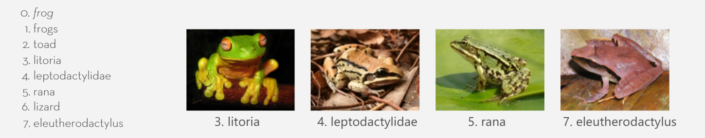

# 详解Glove模型

## 介绍

`glove`是一种生成每个词向量的非监督式算法，基于统计方式(`count-based`)来对语料库中的数据进行训练，最终对每个词进行向量表示。

## 知识点

### Nearest neighbors

最邻近方法。

在词向量空间中，使用欧几里得距离( Euclidean distance) 或余弦相似度( cosine similarity ) 来判断两个词的相似程度还是一个很有用的方法，有时候我们想通过一个词来查找与之类似的其他词，使用这个模型就很容易了。

比如我们想要查找与`frog`的相关的词，`Glove`模型会给我们如下结果：

### 线性子结构

空间中的向量是可以进行数学运算的，而在全局词向量空间中，不同方向上的偏移会产生不同的效果。比如在男人和女人的表示上的差异：

当向量$\vec{woman}-\vec{man}$会得到一个从woman这个点指向man这个点的向量。而woman和man的关系有类似于queen和king的关系，故，当我们预测：women=man时，queen = ？ 此时就会在全局词向量空间中找到最邻近king的向量，并作为输出。

可是，就真的这么简单吗？woman和man之间的关系就只是一个向量就能表示的吗？在很多场合中，男人和女人通常是分类的一个重要标准，甚至是分类轴的核心。那么一个向量能否在不同的上下文中表示不同的含义呢？这个显然是不行的，需要有其他的模型和方法来作为支撑。

参考链接：

[GloVe: Global Vectors for Word Representation](https://nlp.stanford.edu/projects/glove/)

[【论文笔记】Glove: Global Vectors for Word Representation（Glove词向量理解）](https://www.jianshu.com/p/5bbb55c35961)

[paper](https://nlp.stanford.edu/pubs/glove.pdf)

