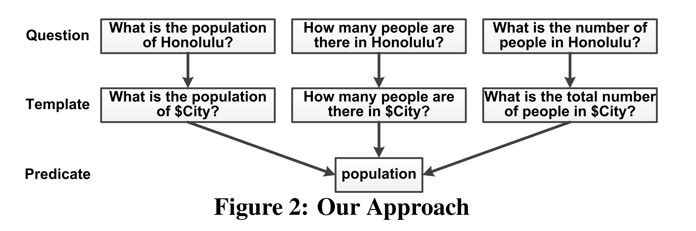
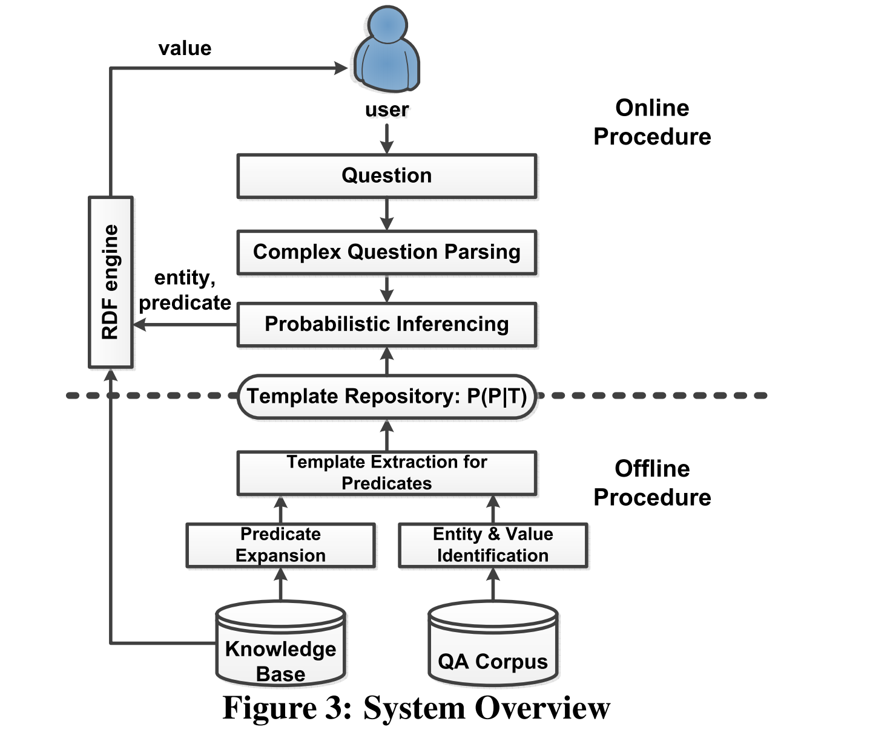

# KBQA: Learning Question Answering over QA Corpora and Knowledge Bases

> 论文地址：[KBQA: Learning Question Answering over QA Corpora and Knowledge Bases]()

## 概述

Query可以通过语言模型进行编码，也可以转化成结构化的文本，从一定程度上提升了精确性，也为QA在知识图谱上面的提供了可能性。即使如此，目前在QA里面最大的挑战还是用户的询问的方式太多变了，让一个智障来回答是在是有点为难他。

`Template Query` 能够产生很多可能性，即使技术有点老套，可是对于现在的人工智障而言还是比较有效的。

## QA 近几年的发展

问题的类型：
- 属性问题
  - 姚明的身高？
- 排序问题
  - 中国人口排名前三的城市有哪些？
- 复杂问题
  - 根据人口来排序

### Previous Work

- Rule Based
  - 高精确率，低召回
- Keyword Based
  - 无法处理复杂的语义情景
- Synonym Based

### Overview of Method

1. Represent by Templates
   对指定实体进行抽取与识别，然后转化成模板形式。
   > 减少不同实体对语义的影响。

   eg :  How many people are there in $city?
   可以统一回复某一类具体的问题。

   对于复杂问题也有作用：将复杂问题分解成子问题。比如询问：姚明老婆的身高是多少？

   那这样实际上可以转化成：
   - 姚明老婆是谁？ -> marriage name
   - 某某的身高是多少？-> some one's height
2. Mapping templates to predicates.
    其实这个任务就是一个分类的任务，可以有多种不同的实现方法，推荐还是使用SOTA模型中的方法。

### KBQA的概览

以上就是这篇论文中主要的模型结构图，处理过程也是很简单，分为Online Proceduer 和 Offline Procedure. 

论文篇章中有大量的公式来阐述生成模型的过程，在此我就不展示了。

## 总结

这篇论文给我们一个比较好的方向：使用Template Learning 来提升QA的精确度，以及将问题进行拆解，从而减少问题的复杂度。