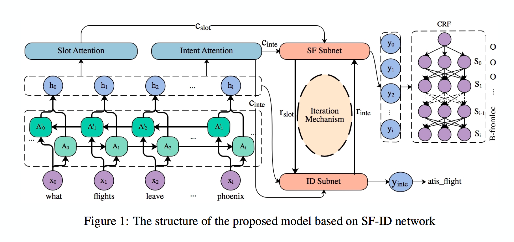
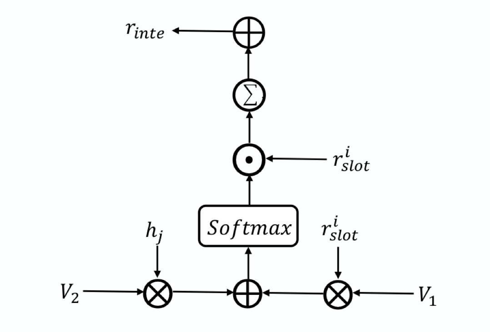

# [A Novel Bi-directional Interrelated Model for Joint Intent Detection and Slot Filling](http://arxiv.org/abs/1907.00390)

> 只讲解不给代码的人，都是耍流氓

## 一、介绍

该论文中提出了一个基于Attention的联合模型，能够加强Slot Filling 和 Intent Detection 之间的有向连接，当时在ATIS数据集上取得了SOTA的效果。

> 注意这里是有向连接，因此也是有双向连接。因为SF和ID之间是存在相互依赖关系，单向依赖和双向依赖都能够加强信息建模。

## 二、模型



### 2.1 整合上下文信息

在SF任务中，每个`token`的标签不仅与单词具体语法和词法信息有关，也与文本的上下文有关。`与上下文有关`不仅在这里有重要的应用，在其他任务中基本上都有其应用，毕竟根据文本判定其含义才是语言的精髓。

而如何根据上下文获取有效信息呢？注意力机制是一个非常好的建模工具。

### 2.2 Slot Attention

在SF模块中，上下文信息获取的

$$
c_{s l o t}^{i}=\sum_{j=1}^{T} \alpha_{i, j}^{S} h_{j}
$$

如图所示，左边是一个`BiLSTM`模型，用于在输入文本中提取特征。而Attention机制与[Attention-Based Recurrent Neural Network Models for Joint Intent Detection and Slot Filling](http://arxiv.org/abs/1609.01454)一致，具体细节请看此论文。


### 2.3 Intent Attention

`IntentDetection`的上下文向量的计算方法与`SF`是一致的，那也就说明 shape($c_{slot}$) = shape($c_{int}$)。虽然获取方法是一致的，可使用的渠道不一样，为两个独立的注意力机制，提取的特征是不一样的。

## 三、SF-ID网络架构

前面提到过`SF subnet`和`ID subnet`自网络是有向连接，也就会存在`SF-First`和`ID-First`这两种模式。前一个网络会将输出的隐藏层信息传递给后一层，这样就会建立一种依赖性关系。

### 3.1 `SF-First`

在这种模式中，`SF subnet`会先执行，过程如下：

- 在`SF subnet`中将$c_{int}$和$c_{slot}$作为输入，生成加强版的$r_{slot}$向量，
- 使用`CRF`和$r_{slot}$来做序列标注任务，完成槽填充这个自任务。


### 3.2 `SF-Subnet`

现在有一个问题就是：$r_{slot}$是如何产生的。这也是SF-Subnet的核心工作原理。

$$
f=\sum V * \tanh \left(c_{\text {slot}}^{i}+W * c_{\text {int}}\right)
$$

$$
r_{\text {slot}}^{i}=f \cdot c_{\text {slot}}^{i}
$$

上述公式中，$f$只是一个加强因子，用于对$c_{slot}$信息进行加强。

从另外一个角度来看，其实这个加强因子更像是一种注意力机制，根据$c_{slot}$和$c_{int}$两种信息来获得$c_{slot}$中的重要信息。

### 3.3 `ID-Subnet`

在`SF-Subnet`中获取了加强版本的上下文向量，那`ID-Subnet`则可基于此来做`ID`任务。

通常`Slot`是`word-level`层面的表征，`Intent`是`sentence-level`层面的表征，故两者是需要使用不同的特征提取机制的，且`word-level`层面的表征也是可用于`sentence-level`的表征。

计算公式如下所示：

$$
r=\sum_{i=1}^{T} \alpha_{i} \cdot r_{s l o t}^{i}
$$

$$
\alpha_{i}=\frac{\exp \left(e_{i, i}\right)}{\sum_{j=1}^{T} \exp \left(e_{i, j}\right)}
$$

$$
e_{i, j}=W * \tanh \left(V_{1} * r_{s l o t}^{i}+V_{2} * h_{j}+b\right)
$$

- $r_{slot}$为来自`SF-subnet`中的加强数据因子
- $h_j$为来自`BiLSTM`的隐藏输出
- $W$, $V_1$, $V_2$为模型中需要学习的参数

回过头来看整个公式的计算逻辑图如下所示：



为了尝试着增强ID的信息量，作者尝试着将$r$和$r_{int}$相加，实验证明效果很好。

$$
r_{i n t e}=r+c_{i n t e}
$$

### 3.4 Interation Mechanism

实际上`ID-Subnet`计算出的$r_{int}$也可以替换最初的$r_{int}$来作为新一轮的输入，来进行计算。

$$
f=\sum V * \tanh \left(c_{\text {slot}}^{i}+W * r_{\text {inte}}\right)
$$

如此有一种可循环计算的可能性，是信息能够更好的达到稳定：重要的更重要，不重要的逐渐会消失。

从另外一个角度来看，`ID-Subnet`和`SF-Subnet`都能够得到梯度更新。

通过很多次循环计算之后，$r_{int}$和$r_{slot}$被用于计算最终的ID和SF。那么对于ID能够融合最初的BiLSTM的输出来联合计算最终的预测结果：

$$
y_{i n t e}=\operatorname{softmax}\left(W_{i n t e}^{h y} \operatorname{concat}\left(h_{T}, r_{i n t e}\right)\right)
$$

如此，能够保证在循环计算过程中信息的损失所带来的影响。

对于SF也是能够融合BiLSTM最终的输出来预测最终的结果：

$$
y_{\text {slot}}^{i}=\operatorname{softmax}\left(W_{\text {slot}}^{h y} \operatorname{concat}\left(h_{i}, r_{\text {slot}}^{i}\right)\right)
$$

当然该结果还是要输入给CRF来作为最终的预测。

## 四、ID-First

这种模式下与`SF-First`是有一些区别的。

### 4.1 ID-Subnet

增强向量$r$的获取需要联合`BiLSTM`和$c_{slot}$上下文向量。

$$
\begin{array}{c}
r=\sum_{i=1}^{T} \alpha_{i} \cdot h_{i} \\
\alpha_{i}=\frac{\exp \left(e_{i, i}\right)}{\sum_{j=1}^{T} \exp \left(e_{i, j}\right)} \\
e_{i, j}=W * \sigma\left(V_{1} * h_{i}+V_{2} * c_{s l o t}^{j}+b\right)
\end{array}
$$

### 4.2 SF-Subnet

$r_{int}$作为输入传递给`ID-Subnet`，增强因子$f$的计算公式没变。

### Iteration Mechanism

两个子网络的交互逻辑也是一样的，我就不再赘述。

## 五、CRF 层

SlotFilling 是一个序列标注任务，CRF能够在全局下获取最大似然估计，获得更好的效果，将此用在`SF-Subnet`最后一层再好不过。同时经过实验证明有效。

## 六、代码解剖

超参数预设：

```python
import torch
batch_size, seq_len, hidden_size, emb_dim = 64, 67, 128, 200

inp = torch.randn(batch)
```

### SlotAttention

```python

class SlotAttention(nn.Module):
    """
    SlotAttention : external attention mechanism
    """
    def __init__(self, hidden_size=128):
        super(SlotAttention, self).__init__()
        self.attention = nn.Linear(hidden_size, hidden_size)

    def forward(self, x):
        """
        x: hidden states from LSTM (batch_size, seq_len, hidden_size)

        :return: slot attention context tensor (batch_size, seq_len, hidden_size)

        core formula:
            attention = softmax(x * linear(x)) * x

        """
        weights = self.attention(x)

        # -> (batch_size, hidden_size, hidden_size)
        weights = torch.matmul(weights, torch.transpose(x, 1, 2))

        # softmax on the final axis
        weights = F.softmax(weights, dim=2)

        output = torch.matmul(weights, x)
        return output
```

### IntentAttention

```python
class IntentAttention(nn.Module):
    """
    IntentAttention : external attention mechanism
    """
    def __init__(self, hidden_size=64):
        super(IntentAttention, self).__init__()
        self.attention = nn.Linear(hidden_size, hidden_size)

    def forward(self, x):
        """
        x: hidden states from LSTM (batch_size, seq_len, hidden_size)

        :return: slot attention context tensor (batch_size, seq_len, hidden_size)

        core formula:
            attention = sum(softmax(x * linear(x)) * x, dim=1)

        difference which between slot and intent is that softmax on final layer,
        but sum on second (sqe_len) layer
        """
        # (batch_size, seq_len, hidden_size)
        weights = self.attention(x)

        # (batch_size, seq_len, seq_len)
        weights = torch.matmul(weights, torch.transpose(x, 1, 2))

        # softmax on final layer
        weights = F.softmax(weights, dim=2)

        output = torch.matmul(weights, x)

        # sum on second layer
        output = torch.sum(output, dim=1)

        return output

```

这是在github找的解决方案，可是感觉与所指论文中的不一致，如果知友们有正确的解决方案请在评论区留言，或者私信我，我好对文章做修改。

这个使用的是外部注意力机制。

### SF-Subnet

- formula

$$
f=\sum V * \tanh \left(c_{s l o t}^{i}+W * c_{i n t e}\right)
$$

$$
r_{\text {slot}}^{i}=f \cdot c_{\text {slot}}^{i}
$$

- code
  - 细节版本
  
    ```python
    def sf_subnet():
        f = []
        for i in range(c_slot.shape[1]):

            # [batch_size, hidden_size]
            state = torch.tanh(c_slot[:, i, :] + W_SF(c_intent))

            # [batch_size, hidden_size]
            state = V_SF(state)
            f.append(state)

        # [batch_size, hidden_size]
        f = torch.stack(f, dim=1).sum(dim=1)

        r_slot = []
        for i in range(c_slot.shape[1]):
            r_slot_i = f * c_slot[:, i, :]
            r_slot.append(r_slot_i)
        r_slot = torch.stack(r_slot, dim=1)
        return r_slot
    ```

  - 简化版本

    ```python
    f = torch.tanh(c_slot + self.W_SF(r_inte).unsqueeze(1))

    # [batch_size, seq_len, hid_size]
    f = self.V_SF(f)

    # [batch_size, hid_size]
    # sum on seq_len
    f = torch.sum(f, dim=1)

    # [batch_size, seq_len, hid_size]
    r_slot = f.unsqueeze(1) * c_slot
    ```

### ID-Subnet

- formula

$$
\begin{array}{c}
\alpha_{i}=\frac{\exp \left(e_{i, i}\right)}{\sum_{j=1}^{T} \exp \left(e_{i, j}\right)} \\
e_{i, j}=W * \tanh \left(V_{1} * r_{\text {slot}}^{i}+V_{2} * h_{j}+b\right)
\end{array}
$$

- code

  - 细节版本
    ```python

    W_ID = torch.nn.Linear(hidden_size, 1)

    def id_subnet():
        """
        slot_features : [batch_size, seq_len, hidden_size]
        hidden_features : [batch_size, seq_len, hidden_size]

        :return alphas: [batch_size, seq_len]
        """
        # [batch_size, seq_len]
        alphas = []
        for i in range(slot_features.shape[1]):
            es = []
            for j in range(slot_features.shape[1]):
                # [batch_size]
                e_i_j = W_ID(torch.tanh(slot_features[:, i, :] + hid_features[:, j, :])).squeeze(dim=-1)
                es.append(e_i_j)
            # [batch_size, seq_len]
            es = torch.stack(es, dim=1)
            a_i = torch.softmax(es, dim=1)
            alphas.append(a_i[:, i])s
        alphas = torch.stack(alphas, dim=1)
        return alphas
    ```

核心的公式和代码都展示完了，各位看官自行理解，我相信代码就不需要我来解释了，毕竟`code is a doc`。

> code -> tensorflow: [github](https://github.com/ZephyrChenzf/SF-ID-Network-For-NLU)