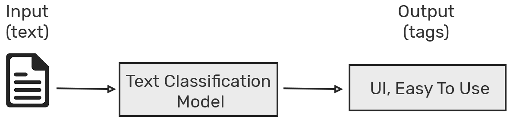
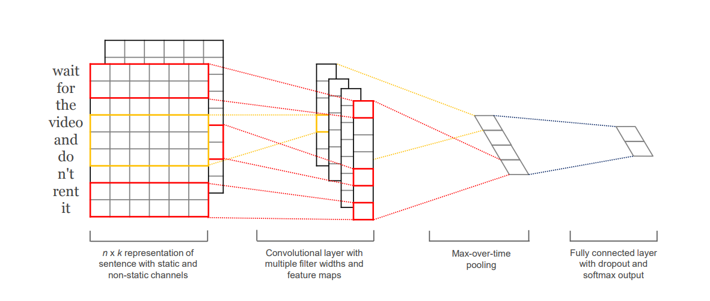
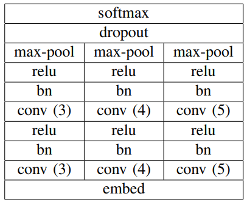
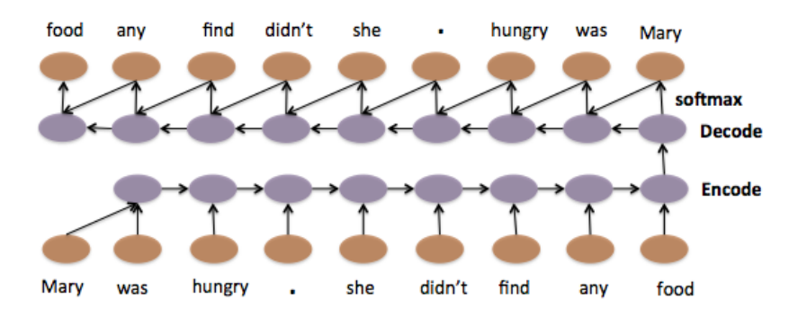
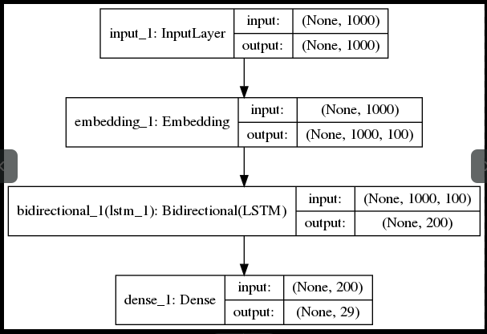
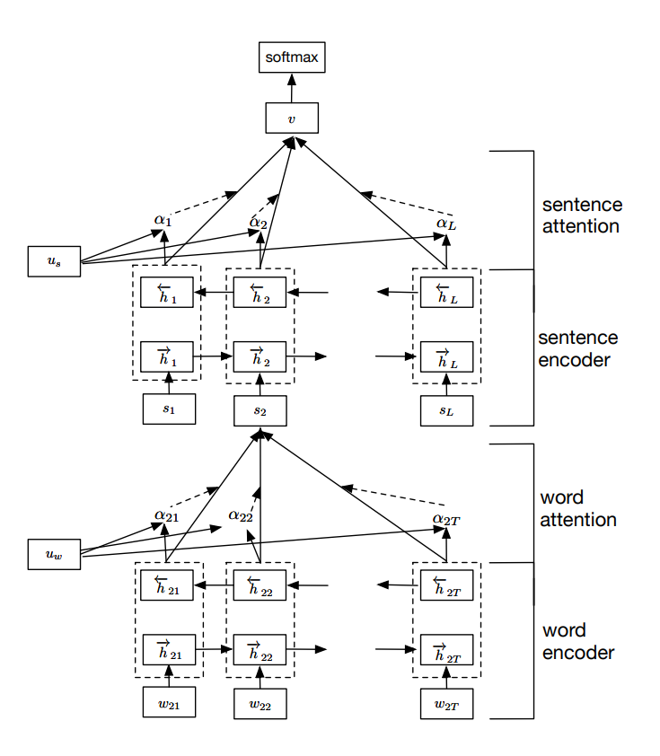
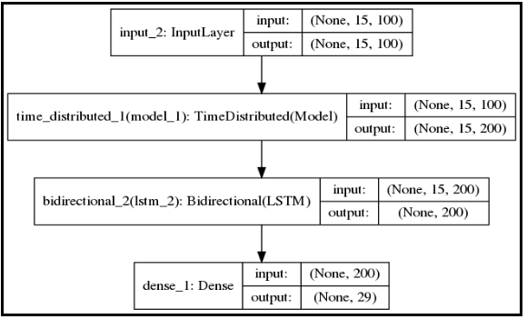

# 使用CNN，RNN和HAN 进行文本分类



🔥 如题，本文将要介绍三种模型：

-  **Convolutional Neural Network (CNN)** 
-  **Recurrent Neural Network (RNN)** 
-  **Hierarchical Attention Network (HAN)** 

## 介绍

文本分类是自然语言处理和监督学习领域一个非常热门的子任务，很多新手的学习也都是从文本分来开始的。那么文本分类是啥？🙈

类似于判定一则新闻是否是垃圾新闻，通常此类数据只需两个字段，比如：`review`，`label`等。我们需要做的就是根据带标签的文本数据，训练出一个判别器，用于识别其类型的正负。常见的文本分类任务有：

- 文本情感分类（喜怒哀乐）
- 垃圾邮件判别
- 用户话语标签（某米音响中的：放歌，闭嘴，关灯等话语）
- 新闻类别分类（历史，娱乐，政治等）

当然应用领域肯定不止这些，分类属于一个非常基础且重要的功能，学好不易，且学且努力。

*****

安利一波文本分类代码：

- [Text-Classification]( https://github.com/jatana-research/Text-Classification )
- [brightmart-text-classification]( https://github.com/brightmart/text_classification )
- [cnn-text-classification-tf]( https://github.com/dennybritz/cnn-text-classification-tf )
- ...... (👩‍💻 自己上gayhub上找)

*****

## 说明

一个健全的文本分类任务是需要准备以下素材的：

- **训练语料** ：没有这个都是*淡

- **WordEmbedding**：可以使用预训练好的词向量，也可以自己训练词向量

  预训练好的词向量： 
  - 中文：https://github.com/Embedding/Chinese-Word-Vectors 
  - 英文：
    - [glove](https://nlp.stanford.edu/projects/glove/ )
    - [fasttext]( https://fasttext.cc/docs/en/english-vectors.html )
    - [word2vec]( https://github.com/xgli/word2vec-api )

- **标签**：这个一般是和训练语料放在一起的，由标签种类的数量可以将文本分类认为二分类和多分类任务

- **模型**：用来训练语料生成最终的判别器


好了，该介绍的废话都说完了，接下来就开始介绍其中多种模型了。有研究背景的同学，**一定要看论文**，**一定要看论文**，**一定要看论文**，地址在最底下自己找，本文中的图也大多数来自于原论文。

## CNN

首先我假设各位大佬们都了解CNN的基本原理，那如何将CNN应用在文本上呢？在此我通过[TextCNN]( https://arxiv.org/pdf/1408.5882.pdf )来讲解，参考了[ What Does a TextCNN Learn? ]( https://arxiv.org/pdf/1801.06287.pdf )论文来给大家讲解，希望大家能够吸收消化20%就已经很不错了。

首先来看看其整体架构图：



**左边**是由两个 `static vectors `和 `non-static vectors`组成，两者的区别在于词向量能否**学习**（微调）。这个特性能够让网络拥有一定的基础*文字关系* 的 **记忆**和**学习**能力。

> 词向量一般基于大量的语料库学习而来，里面包含语法和语义的相关信息，这些信息可以使用**相似度**来进行描述，通过**统计方法**得来。而这些仅仅只是通过一定的统计方法得来的特征，到底能不能经得起**验证**（loss函数的验证）就不得而知了，所以此处的学习能力是非常重要的。
>
> 另外，如果对词向量的学习可以看看[这篇论文]( https://www.aclweb.org/anthology/P14-1146/ )或者[这篇博客]( https://lilianweng.github.io/lil-log/2017/10/15/learning-word-embedding.html )

中间就是卷积核学习而来的结果，接下来做`max pooling`操作，选出一个`channel`最大的值最终拼接到一起。然后再来个全连接。简单的代码如下所示：

```python
sequence_input = Input(shape=(MAX_SEQUENCE_LENGTH,), dtype='int32')
embedded_sequences = embedding_layer(sequence_input)
l_cov1= Conv1D(128, 5, activation='relu')(embedded_sequences)
l_pool1 = MaxPooling1D(5)(l_cov1)
l_cov2 = Conv1D(128, 5, activation='relu')(l_pool1)
l_pool2 = MaxPooling1D(5)(l_cov2)
l_cov3 = Conv1D(128, 5, activation='relu')(l_pool2)
l_pool3 = MaxPooling1D(35)(l_cov3)  # global max pooling
l_flat = Flatten()(l_pool3)
l_dense = Dense(128, activation='relu')(l_flat)
preds = Dense(len(macronum), activation='softmax')(l_dense)
```

最后生成的模型的架构图如下所示：



为啥CNN能够在文本序列中学习到序列特征呢？后面我也会出相关的博文阐述。

## RNN

使用RNN及其扩展模型来处理文本序列模型才是大家认为的常见操作，也被实践证明是处理效果最好的方法。在此RNN的基本概念我就不说了，不熟悉的也可以看[Colah‘s blog](http://colah.github.io/posts/2015-08-Understanding-LSTMs/)，另外对LSTM不熟悉的孩童们，可以看看我的[这篇博文]( https://zhuanlan.zhihu.com/p/82325657 )，里面有详细说明其中的概念。

RNN在处理序列数据方面能力那是杠杠的，因为本身架构就是为序列而生的。序列数据领域包含：文本，时序，视频，DNA数据等等。

接下来我的模型架构如下：

- `Embedding` 

  可以直接使用预训练模型，种类在上文

- `LSTM Encoder`

  使用LSTM对word进行简单编码

- `Full Connected Network`

  对输出结构进行全连接操作，输出最终分类



由上图所见，这是一个很标准的`Sequence to Sequence`模型，可以分为以下几点理解：

- Encoder

  词向量序列喂给LSTM之后，会生成一个隐藏层向量，也就是Encoder/LSTM的输出。上面Encoder中只是包含比较简单的一层LSTM，也可以添加稍微复杂点的[Attention](https://arxiv.org/abs/1706.03762)机制，也可以添加[层级基于Attention的Sequence2Sequence]( https://arxiv.org/pdf/1506.01057v2.pdf )结构，结构可以很复杂，一般处理下过也是很好的。不过咱们还得一步一步来。

  Encoder的输出被称作为`Context Vector`，这个就是Encoder对输入这句话的`理解`，然后Decoder对这句话进行翻译，解码。

- Decoder

  一般结构与Encoder一致，即使有差别也差别不大。

  你怎么编码，我就怎么解码，不然两者的**脑回路**不一样，理解的结果也就不一样。

- 全连接层

  这个就是对解码后的信息点进行**加权处理**，最终得到分类结果。

Keras代码如下所示：

```python
sequence_input = Input(shape=(MAX_SEQUENCE_LENGTH,), dtype='int32')
embedded_sequences = embedding_layer(sequence_input)
l_lstm = Bidirectional(LSTM(100))(embedded_sequences)
preds = Dense(len(macronum), activation='softmax')(l_lstm)
model = Model(sequence_input, preds)
model.compile(loss='categorical_crossentropy',optimizer='rmsprop',  metrics=['acc'])
```

最终的架构图如下所示：



## HAN 

> 全称：Hierarchical Attention Network，详细了解请看这篇[论文](https://www.cs.cmu.edu/~hovy/papers/16HLT-hierarchical-attention-networks.pdf)。

这个小节，我将要给大家介绍`层级LSTM`网络。模型结构如下所示：



上面我已经讲了两种模型图，如果这个还不懂，可以再回过头过去看看，之后再回来看这个应该就明白了。

keras 伪代码如下所示：

```python
embedding_layer=Embedding(len(word_index)+1,EMBEDDING_DIM,weights=[embedding_matrix],
input_length=MAX_SENT_LENGTH,trainable=True)
sentence_input = Input(shape=(MAX_SENT_LENGTH,), dtype='int32')
embedded_sequences = embedding_layer(sentence_input)
l_lstm = Bidirectional(LSTM(100))(embedded_sequences)
sentEncoder = Model(sentence_input, l_lstm)

review_input = Input(shape=(MAX_SENTS,MAX_SENT_LENGTH), dtype='int32')
review_encoder = TimeDistributed(sentEncoder)(review_input)
l_lstm_sent = Bidirectional(LSTM(100))(review_encoder)
preds = Dense(len(macronum), activation='softmax')(l_lstm_sent)
model = Model(review_input, preds)
```

上述代码模型结构如下：



## 参考文章及论文：

> 其中大部分论文地址，我都放在文章中，在此就不重复一一罗列了。

- [Report on Text Classification using CNN, RNN & HAN]( https://medium.com/jatana/report-on-text-classification-using-cnn-rnn-han-f0e887214d5f )
- [Convolutional Neural Networks for Sentence Classification]( https://arxiv.org/abs/1408.5882 )
- [What Does a TextCNN Learn?]( https://arxiv.org/abs/1801.06287 )
- 