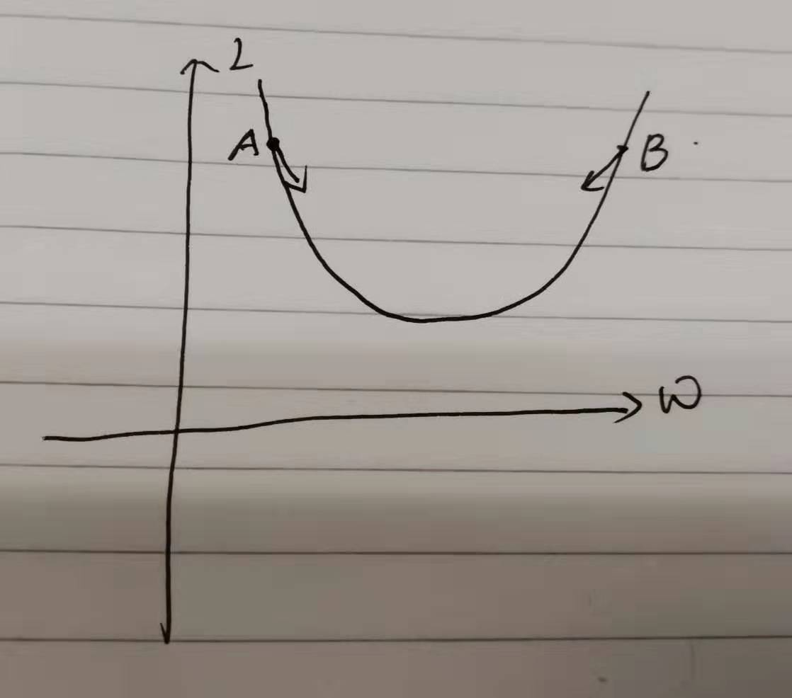
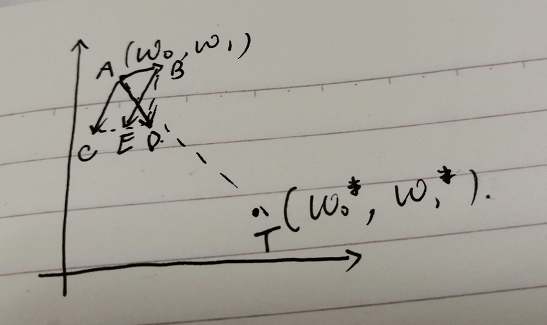

# 激活函数的输出值中心化问题

## 原问题描述

❓ `sigmoid`和`relu`的输出值都是非零点对称，故有肯能会导致收敛速度过慢的问题。

## 网上的解释如下

👦 [why-are-non-zero-centered-activation-functions-a-problem-in-backpropagation](https://stats.stackexchange.com/questions/237169/why-are-non-zero-centered-activation-functions-a-problem-in-backpropagation)

👦 [谈谈激活函数以零为中心的问题](https://liam.page/2018/04/17/zero-centered-active-function/)

网络中某神经元的公式为：$f(\vec x; \vec w, b) = f\bigl(w_0x_0 + w_1x_1 + b\bigr).$

w的参数普遍更新方式为：$w \gets w - \eta\cdot\frac{\partial L}{\partial w}.$
现在假设当前参数值和目标值有如下关系：
$$\begin{cases}w_0 < w_0^{*}, \\ w_1\geqslant w_1^{*}.\end{cases}$$
实际参数更新的路径如下图红色线段所示：

根据实际梯度下降公式：
$$\frac{dL}{dw_i}=\frac{dL}{df}\frac{df}{dw_i}=\frac{dL}{df}x_i$$

最终更新参数的公式为：
$$w \gets w - \eta\cdot\frac{dL}{df}x_i$$
$\frac{dL}{df}$对于$x_i$来说只是一个常数，那么最终更新的方向就与$x$有关系。问题就出在这里：在训练样本中，$x$由于是随机的，可经过$sigmoid$之后总是正值，可是无论$x_i$怎么变，都是梯度更新中的参数，最终作为整体来当做更新的梯度方向。
例如下图：

🤘在A或B点更新的梯度方向如图所示，在此处，个人觉得**x_i**一直为正值，正好符合局部更新的梯度方向，不然在一个batch当中，有五个正值，五个负值，将会一会上一会下，最终更新的效果将会抵消，降低收敛的效果。

🤘另外，对于博主图中的更新图，我也有一些疑问？

如下图所示：

AB线段为第一次更新，BE为第二次更新，可是这是分别针对于$w_0$和$w_1$的更新，参数都是批量同时更新的，故一次更新的方向应该是：AD方向，更好是符合最短路径。

以上是我对问题的理解和有疑问的地方，如果大佬发现我的理解有误，跪请指出我理解错误的地方，谢谢！
