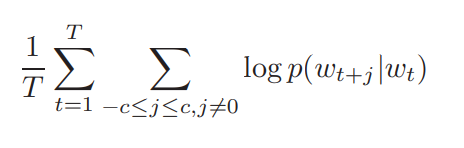

> 以下为一系列的理论笔记

# [ Distributed Representations of Words and Phrases and their Compositionality ]( https://papers.nips.cc/paper/5021-distributed-representations-of-words-and-phrases-and-their-compositionality.pdf )

## Introduction

词的表达能力被语言本身的灵活性所限制，比如"Boston" 和 "Globe"两个单词，如果将两者融合在一起，“Boston Globe”就表示波士顿的一家媒体，可是这在词向量层面是很难以去表达任意两个向量相加之后的语义，至少如果想要让`Skip-gram`模型学习到这个语义的话，代价是非常昂贵的，更别说是用一个词向量代表整个句子。不过也有一些技术手段可以达到用一个词向量来表示一个句子，比如：[`recursive autoencoder`]( http://www.robotics.stanford.edu/~ang/papers/emnlp11-RecursiveAutoencodersSentimentDistributions.pdf )，当然也有一定的效果。

从基于单词的模型扩展到基于短语的模型是非常简单的。

-  首先，我们基于数据驱动的方式去识别出文本中多个短语，然后在训练期间将其作为单个（短语）标记。
- 为了评价短语词向量的好坏，内部也包含了一个单词和短语的测试集，例如其中一个典型的类比是：“Montreal”:“Montreal Canadiens”::“Toronto”:“TorontoMaple Leafs”.  如果最终的词向量符合`Vector(Montreal Canadiens)` - `Vector(Montreal)`  与 `Vector(Toronto Maple Leafs)` - `Vector(Toronto)`相近的话，我们就说这两对词向量学习的效果是非常好的。
- `Skip-Gram`模型中的发现：当我们对某些向量做简单的相加时，可以发现简单相加也是可以实现语义的转移的，比如：`Vector(俄罗斯)` + `Vector(河流)` 向量空间很靠近 `Vector(伏加尔河)` ，类似的 `Vector(德国)`+ `Vector(首都)` 向量空间很靠近 `Vector(柏林)`。

## Skip-Gram模型

该模型主要的作用就是找到一个**能够预测周围上下文有信息量单词的单词**，通过窗口滑动

目标是最大化以上概率，而其中的$p(W_{t+j}|W_t)$是使用`softmax`组成，

